# TINKER Third Party Plugins

This repository collects excellent web-based open source tool projects and converts them into [TINKER](https://github.com/liriliri/tinker) plugins.

## Plugins

All plugins in the list can be installed to TINKER by running `npm i -g tinker-xxx`.

<table width="100%" style="text-align:center">
  <tbody>
    <tr>
      <th width="50%"><a href="./packages/tinker-audiomass/">tinker-audiomass</a></th>
      <th><a href="./packages/tinker-blockbench/">tinker-blockbench</a></th>
    </tr>
    <tr>
      <th>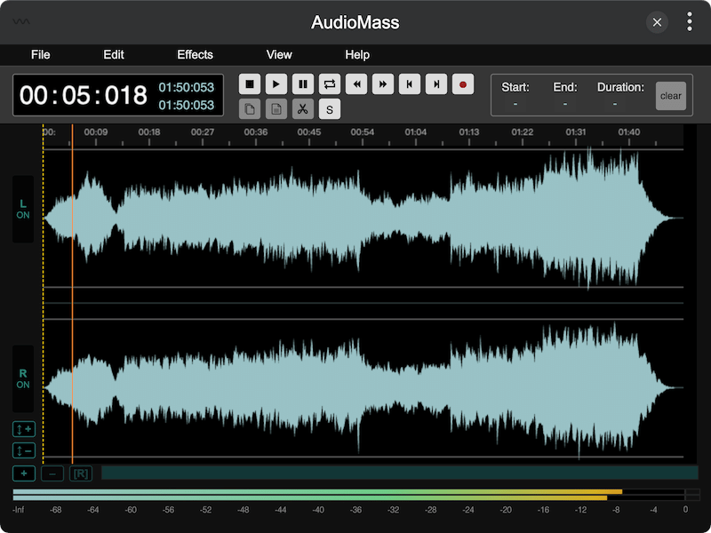</th>
      <th>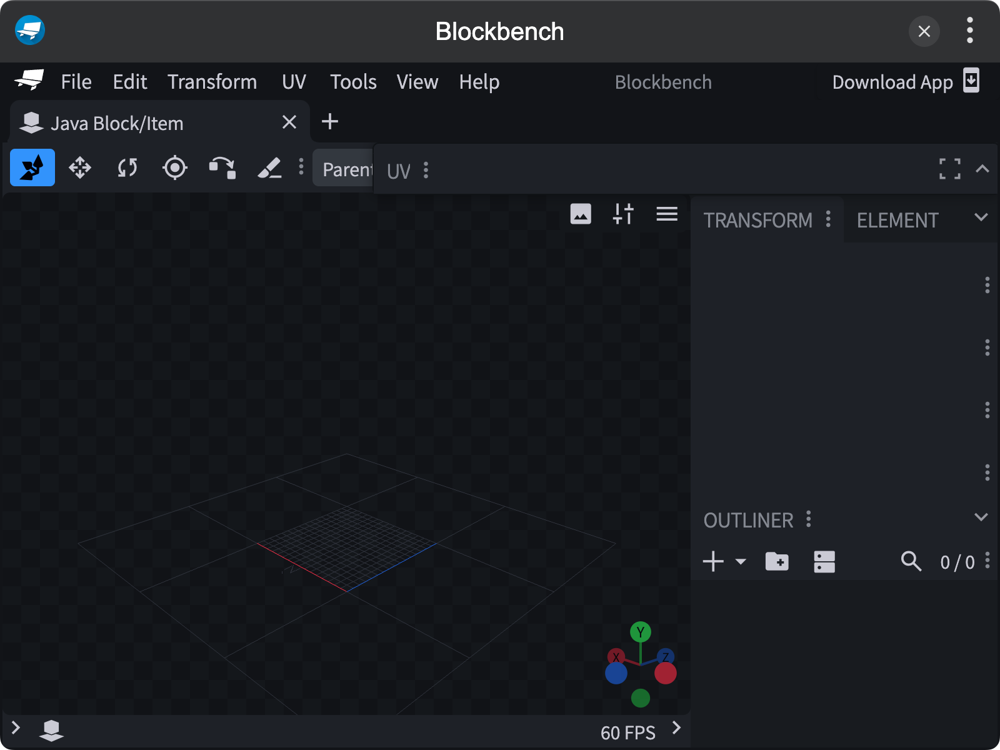</th>
    </tr>
    <tr>
      <th><a href="./packages/tinker-chili3d/">tinker-chili3d</a></th>
      <th><a href="./packages/tinker-ctool/">tinker-ctool</a></th>
    </tr>
    <tr>
      <th>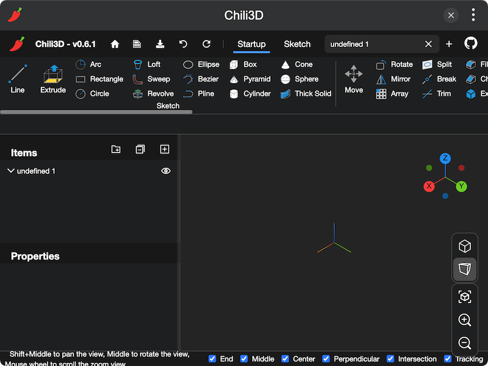</th>
      <th>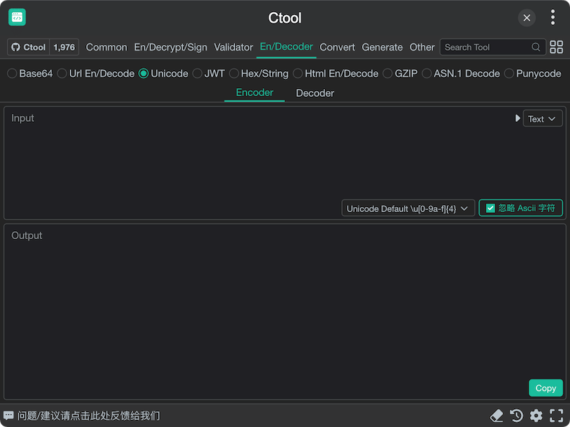</th>
    </tr>
    <tr>
      <th><a href="./packages/tinker-dpaint/">tinker-dpaint</a></th>
      <th><a href="./packages/tinker-drawio/">tinker-drawio</a></th>
    </tr>
    <tr>
      <th>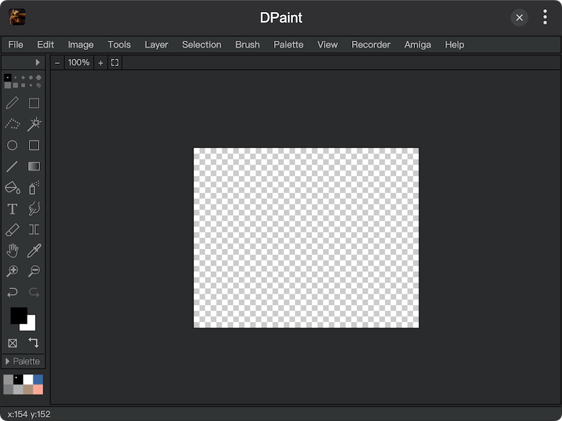</th>
      <th>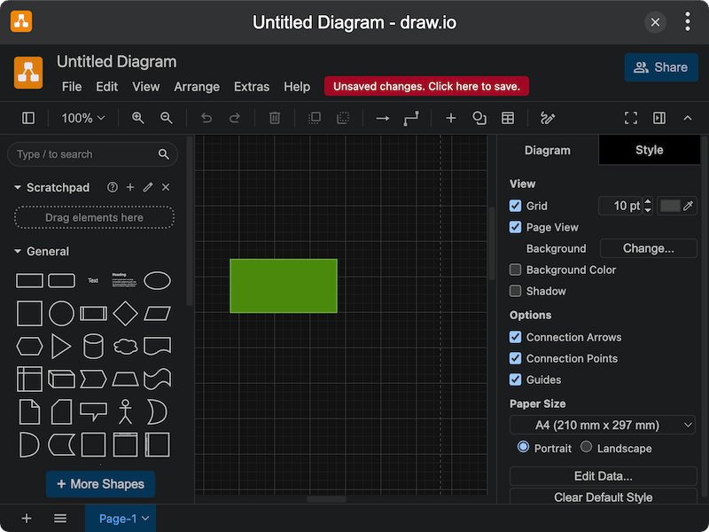</th>
    </tr>
    <tr>
      <th><a href="./packages/tinker-excalidraw/">tinker-excalidraw</a></th>
      <th><a href="./packages/tinker-hoppscotch/">tinker-hoppscotch</a></th>
    </tr>
    <tr>
      <th>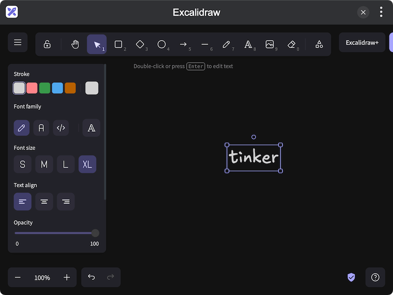</th>
      <th>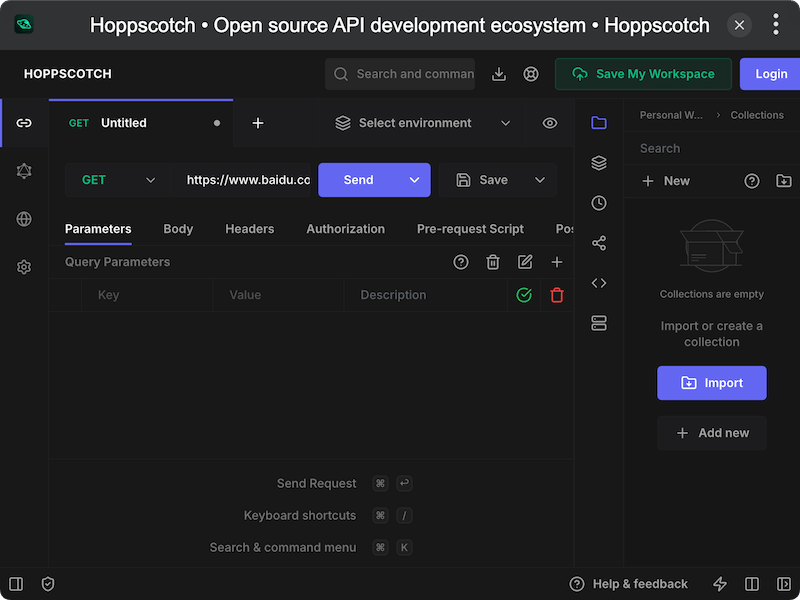</th>
    </tr>
    <tr>
      <th><a href="./packages/tinker-jsoncrack/">tinker-jsoncrack</a></th>
      <th><a href="./packages/tinker-jspaint/">tinker-jspaint</a></th>
    </tr>
    <tr>
      <th>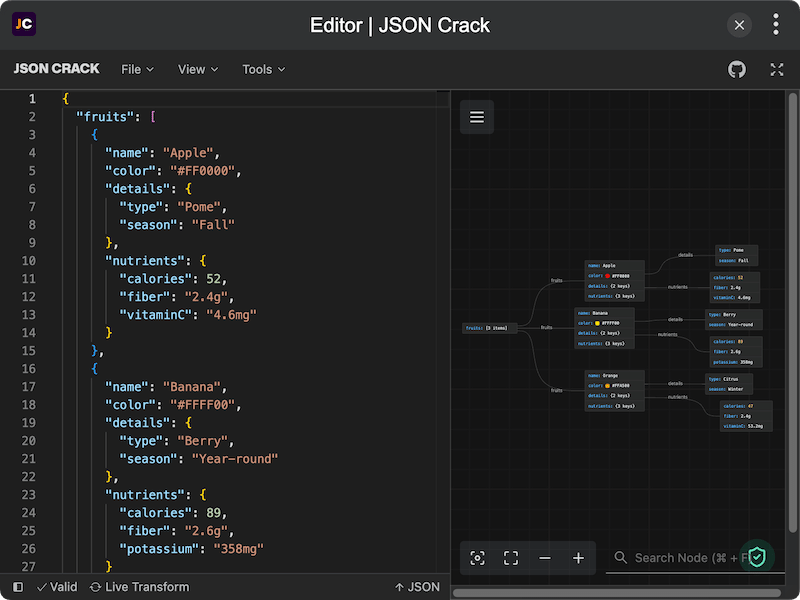</th>
      <th>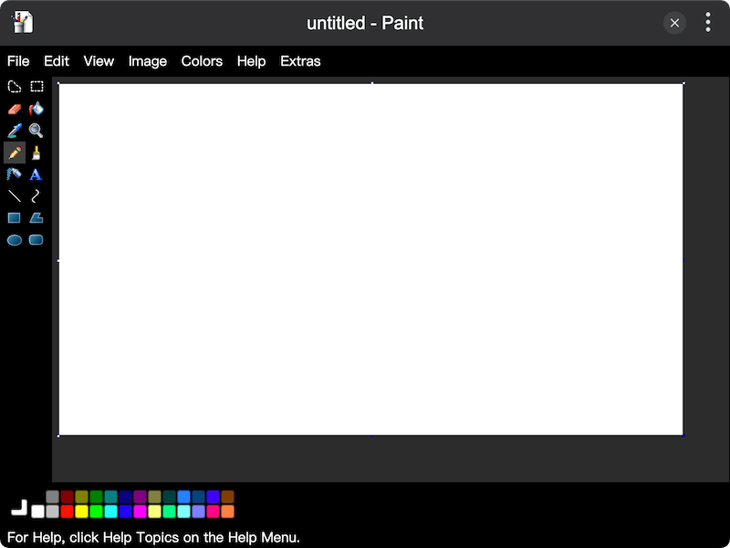</th>
    </tr>
    <tr>
      <th><a href="./packages/tinker-klecks/">tinker-klecks</a></th>
      <th><a href="./packages/tinker-method-draw/">tinker-method-draw</a></th>
    </tr>
    <tr>
      <th>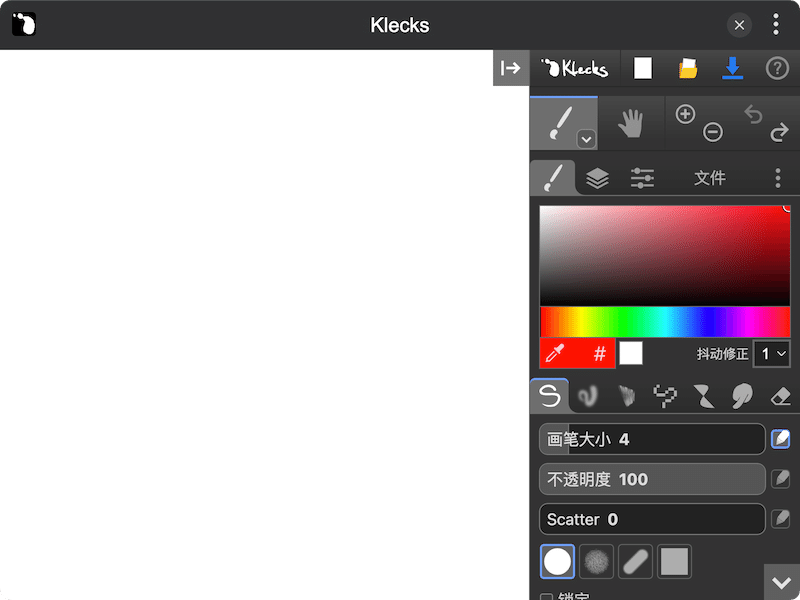</th>
      <th>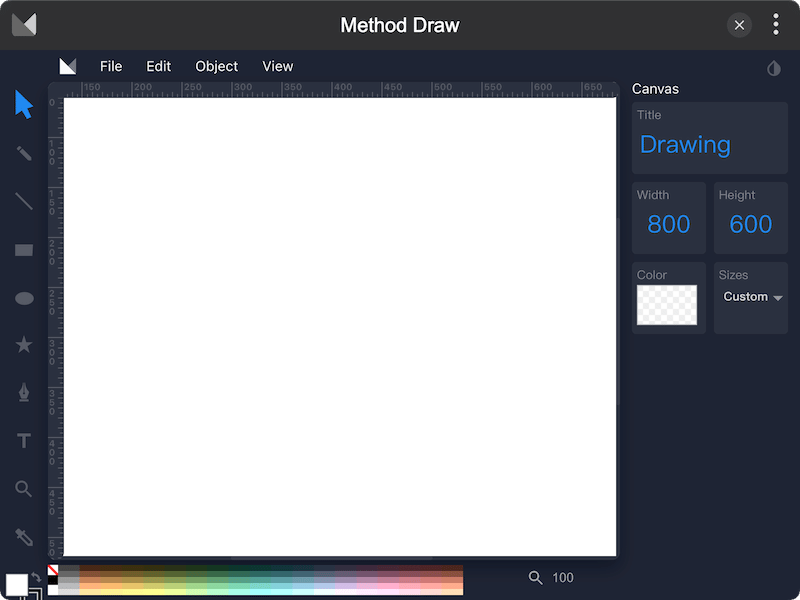</th>
    </tr>
    <tr>
      <th><a href="./packages/tinker-minipaint/">tinker-minipaint</a></th>
      <th><a href="./packages/tinker-motionity/">tinker-motionity</a></th>
    </tr>
    <tr>
      <th>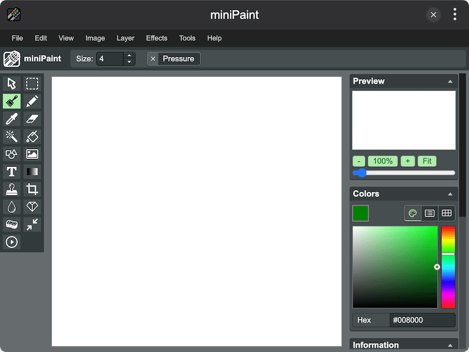</th>
      <th>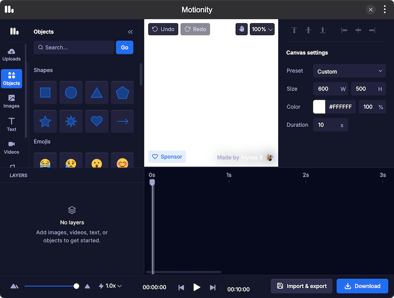</th>
    </tr>
    <tr>
      <th><a href="./packages/tinker-piskel/">tinker-piskel</a></th>
      <th><a href="./packages/tinker-regex-vis/">tinker-regex-vis</a></th>
    </tr>
    <tr>
      <th>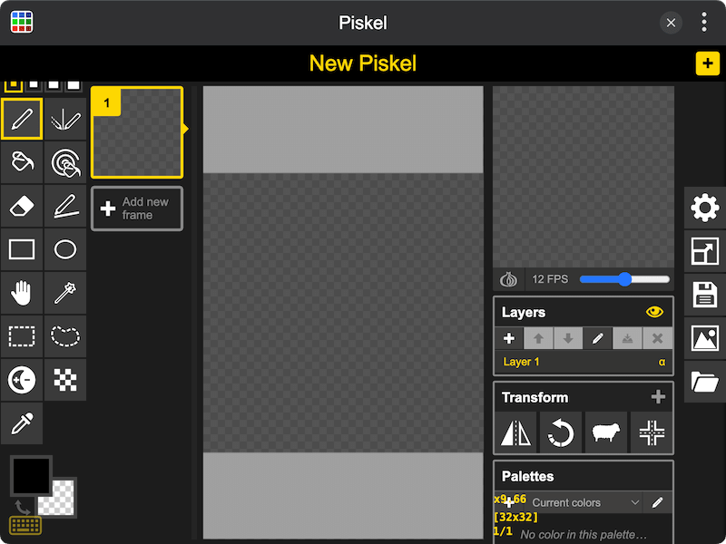</th>
      <th>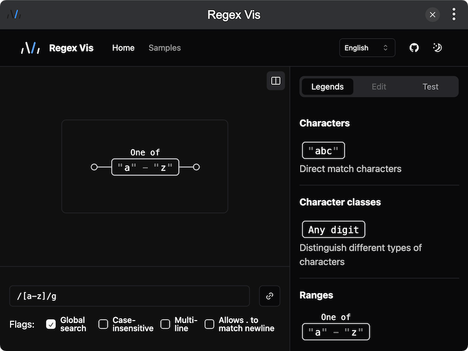</th>
    </tr>
  </tbody>
</table>
